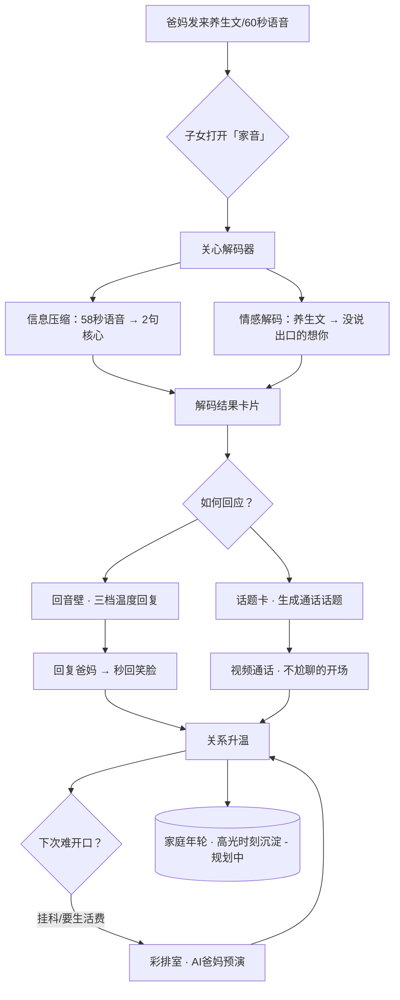
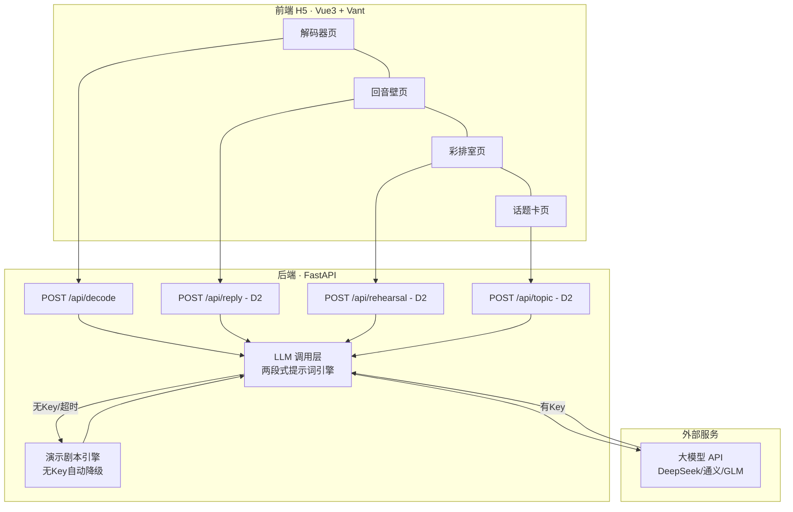
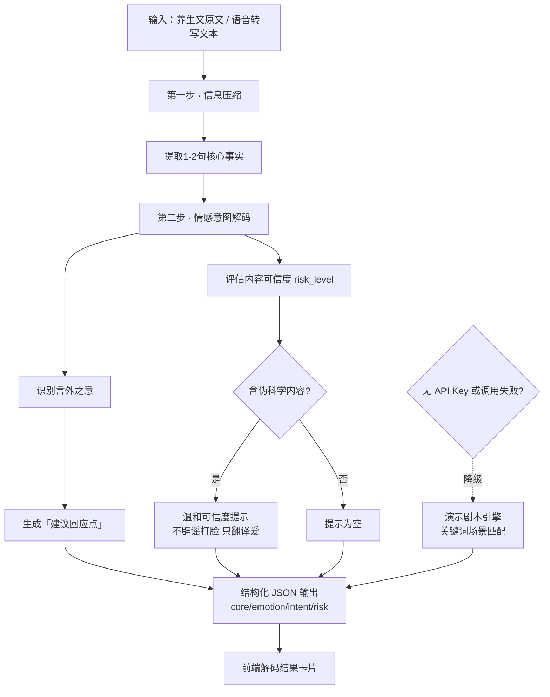

# 家音 · 流程图（Mermaid）

> 使用方法：将每段代码粘贴到 https://mermaid.live ，导出 SVG/PNG，用于产品说明书与参赛辅助材料。

## 图 1 · 用户使用旅程图（从收到养生文到重新连接）

```mermaid
flowchart TD
    A[爸妈发来养生文/60秒语音] --> B{子女打开「家音」}
    B --> C[关心解码器]
    C --> D[信息压缩：58秒语音 → 2句核心]
    C --> E[情感解码：养生文 → 没说出口的想你]
    D --> F[解码结果卡片]
    E --> F
    F --> G{如何回应？}
    G --> H[回音壁 · 三档温度回复]
    G --> I[话题卡 · 生成通话话题]
    H --> J[回复爸妈 → 秒回笑脸]
    I --> K[视频通话 · 不尬聊的开场]
    J --> L[关系升温]
    K --> L
    L --> M{下次难开口？}
    M -->|挂科/要生活费| N[彩排室 · AI爸妈预演]
    N --> L
    L --> O[(家庭年轮 · 高光时刻沉淀 - 规划中)]
```

## 图 2 · 系统架构与数据流

```mermaid
flowchart TB
    subgraph FE[前端 H5 · Vue3 + Vant]
        UI1[解码器页] --- UI2[回音壁页] --- UI3[彩排室页] --- UI4[话题卡页]
    end
    subgraph BE[后端 · FastAPI]
        API1[POST /api/decode]
        API2[POST /api/reply - D2]
        API3[POST /api/rehearsal - D2]
        API4[POST /api/topic - D2]
        ENG[LLM 调用层<br/>两段式提示词引擎]
        DEMO[演示剧本引擎<br/>无Key自动降级]
    end
    subgraph EXT[外部服务]
        LLM[大模型 API<br/>DeepSeek/通义/GLM]
    end
    UI1 --> API1 --> ENG
    UI2 --> API2 --> ENG
    UI3 --> API3 --> ENG
    UI4 --> API4 --> ENG
    ENG -->|有Key| LLM
    ENG -->|无Key/超时| DEMO
    LLM --> ENG
    DEMO --> ENG
```

## 图 3 · 关心解码器技术流程（两段式）

```mermaid
flowchart TD
    A[输入：养生文原文 / 语音转写文本] --> B[第一步 · 信息压缩]
    B --> B1[提取1-2句核心事实]
    B1 --> C[第二步 · 情感意图解码]
    C --> C1[识别言外之意]
    C --> C2[评估内容可信度 risk_level]
    C1 --> D[生成「建议回应点」]
    C2 --> E{含伪科学内容?}
    E -->|是| F[温和可信度提示<br/>不辟谣打脸 只翻译爱]
    E -->|否| G[提示为空]
    D --> H[结构化 JSON 输出<br/>core/emotion/intent/risk]
    F --> H
    G --> H
    H --> I[前端解码结果卡片]
    E2{无 API Key 或调用失败?} -.->|降级| J[演示剧本引擎<br/>关键词场景匹配]
    J --> H
```
